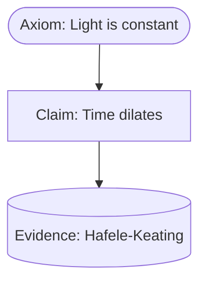

# Obsidian Semantic AI Plugin

An AI-enhanced semantic plugin for Obsidian that enables academic-level tagging, visual flow graphs, and metadata management — all embedded in the note and driven by native AI.

## Features

### Core Functionality

- **Inline Tagging with Hidden Structure** - AI-generated classifications are stored as hidden metadata with UUIDs
- **Native AI Classification** - Classify notes using OpenAI, Anthropic, Ollama, or custom API endpoints
- **Custom Prompts** - Fully editable prompts for every classification type
- **Batch Processing** - Classify entire folders with token cost estimates
- **Visual Graphs** - Auto-generated Mermaid.js diagrams showing semantic relationships
- **Multi-layer Tag System** - Support for note → paragraph → sentence → term hierarchy
- **Postgres Sync Ready** - UUID-based tagging for future database integration

### Supported Tag Types

| Tag Type | Description |
|----------|-------------|
| Axiom | Core foundational truths that don't rely on prior proof |
| Claim | Assertions that can be supported or refuted |
| Evidence Bundle | Empirical data, quotes, or logical arguments |
| Scientific Process | Methodologies and experimental procedures |
| Relationship | Connections between concepts, entities, or events |
| Internal Link | References to other notes or sections |
| External Link | References to external sources or citations |
| Proper Name | People, places, organizations |
| Forward Link | Topics for future exploration |
| Word Ontology | Specialized terms with definitions |
| Sentence | Key sentences with important content |
| Paragraph | Logical units of thought |
| Custom | User-defined categories |

### Tag Format

Tags are stored at the bottom of notes in this format:

```
%%tag::TYPE::UUID::"Label"::parent_UUID%%
```

Example:
```
%%--- SEMANTIC TAGS ---%%
%%tag::Axiom::a1b2c3d4-e5f6-4a7b-8c9d-0e1f2a3b4c5d::"Conservation of Energy"::null%%
%%tag::Claim::b2c3d4e5-f6a7-4b8c-9d0e-1f2a3b4c5d6e::"Renewable energy is sustainable"::a1b2c3d4-e5f6-4a7b-8c9d-0e1f2a3b4c5d%%
%%--- END SEMANTIC TAGS ---%%
```

## Installation

### From Source

1. Clone this repository into your vault's `.obsidian/plugins/` folder
2. Run `npm install` to install dependencies
3. Run `npm run build` to compile the plugin
4. Enable the plugin in Obsidian Settings → Community Plugins

### Development

```bash
# Install dependencies
npm install

# Build for production
npm run build

# Watch for changes during development
npm run dev
```

## Configuration

### AI Provider Setup

1. Open Settings → Semantic AI → AI Settings
2. Select your AI provider:
   - **OpenAI**: Requires API key, uses GPT models
   - **Anthropic**: Requires API key, uses Claude models
   - **Ollama**: Free, local inference (no API key needed)
   - **Custom**: Any OpenAI-compatible API

3. Enter your API key (if required)
4. Select your preferred model
5. Click "Test" to verify connection

### Recommended Models

| Provider | Model | Speed | Cost |
|----------|-------|-------|------|
| OpenAI | gpt-4o-mini | Fast | $0.15/1M tokens |
| OpenAI | gpt-4o | Moderate | $2.50/1M tokens |
| Anthropic | claude-3-haiku | Fast | $0.25/1M tokens |
| Anthropic | claude-3-sonnet | Moderate | $3.00/1M tokens |
| Ollama | llama2 | Varies | Free |

## Usage

### Commands

| Command | Description |
|---------|-------------|
| `Run AI Classifier` | Classify current note with default types |
| `Run AI Classifier (Select Types)` | Choose which tag types to identify |
| `Classify as: Axiom/Claim/Evidence` | Classify for a specific type only |
| `Toggle Hidden Tags Visibility` | Show/hide tag blocks in notes |
| `Open Semantic Map` | Open the Mermaid diagram panel |
| `Regenerate Semantic Graph` | Rebuild the graph for current note |
| `Batch Classify Folder` | Process all notes in a folder |

### Right-Click Menu

**On Notes:**
- Run AI Classifier
- Open Semantic Map
- Show Hidden Tags
- Classify as...

**On Folders:**
- Batch Classify This Folder

### Prompt Editing

1. Go to Settings → Semantic AI → Prompt Editor
2. Select a tag type tab (Axioms, Claims, Evidence, etc.)
3. Edit the prompt text
4. Click "Reset" to restore defaults

### Custom Classifiers

Create your own semantic categories:

1. Go to Settings → Semantic AI → Custom Classifiers
2. Enter a keyword (e.g., "hypothesis")
3. Write a custom prompt
4. Click "Add Classifier"

Use via command: `Run AI Classifier (Select Types)` and select your custom type.

## Visual Graphs

The plugin generates Mermaid.js diagrams showing semantic relationships:



Configure in Settings → Semantic AI → Graph Settings:
- **Direction**: Top-down, Left-right, etc.
- **Theme**: Default, Forest, Dark, Neutral
- **Position**: Side panel or appended to note

## Project Structure

```
src/
  ai/
    classifier.ts       # AI classification logic
    prompt-manager.ts   # Prompt management
  tagging/
    tag-writer.ts       # Tag CRUD operations
    uuid-generator.ts   # UUID generation
  ui/
    mermaid-view.ts     # Graph visualization
    result-panel.ts     # Result modals
    prompt-tabs.ts      # Settings UI components
  main.ts               # Plugin entry point
  settings.ts           # Settings tab
  types.ts              # TypeScript interfaces
```

## Backend Sync (Phase 2)

The plugin is designed for future integration with:
- PostgreSQL database
- Python sync service

All tags include UUIDs that serve as global identifiers for cross-platform syncing.

To enable (when implemented):
1. Settings → Semantic AI → Backend Sync
2. Enter PostgreSQL connection string
3. Enter Python service URL
4. Test connection

## API Reference

### Tag Interface

```typescript
interface SemanticTag {
  type: TagType;
  uuid: string;
  label: string;
  parentUuid: string | null;
  customType?: string;
  metadata?: Record<string, unknown>;
}
```

### Classification Result

```typescript
interface ClassificationResult {
  tags: SemanticTag[];
  mermaidGraph?: string;
  summary?: string;
}
```

## Contributing

1. Fork the repository
2. Create a feature branch
3. Make your changes
4. Submit a pull request

## License

MIT License - see LICENSE file for details.

## Credits

Inspired by [obsidian-note-definitions](https://github.com/dominiclet/obsidian-note-definitions)

---

Built with TypeScript for Obsidian.
